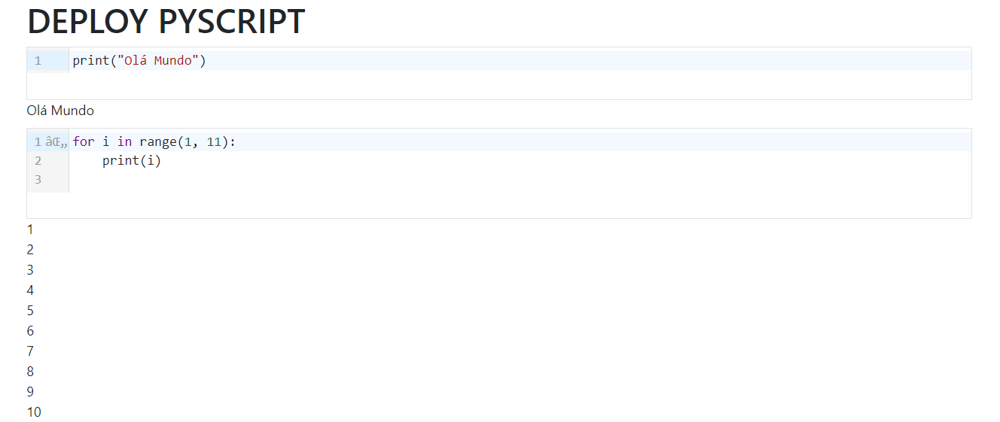

# REPL COM PYSCRIPT
👨‍🏫PROJETO CRIADO PARA O CURSO DE PYSCRIPT.

  

## DESCRIÇÃO:
- Este é um aplicativo da web chamado de `REPL COM PYSCRIPT`, que fornece um ambiente de REPL (Read-Eval-Print Loop) para escrever e executar código Python diretamente no navegador da web.

- Ele oferece uma maneira conveniente e eficiente de experimentar, aprender e desenvolver em Python diretamente no navegador, sem a necessidade de instalar ou configurar um ambiente de desenvolvimento local.

## EXECUTANDO O PROJETO:
1. Abra a página `./CODIGO.html` em um navegador da web.
2. Na interface do aplicativo, você verá uma área de entrada de código Python.
3. Escreva seu código Python na área de entrada.
4. Clique com o mouse na linha branca abaixo do código (E abaixo do número) para iniciar a execução do código Python. 
5. Os resultados da execução, incluindo saídas, erros e mensagens, serão exibidos diretamente abaixo da área de entrada de código.
6. Você pode continuar escrevendo e executando mais código conforme necessário.
7. Explore as funcionalidades adicionais do aplicativo para experimentar diferentes recursos e otimizar sua experiência de desenvolvimento Python online.

## NÃO SABE?
- Entendemos que para manipular arquivos e muitas linguagens relacionadas, é necessário possuir conhecimento nessas áreas. Para auxiliar nesse aprendizado, oferecemos subsidios:
* [CURSO DE PYSCRIPT](https://github.com/VILHALVA/CURSO-DE-PYSCRIPT)
* [CURSO DE BOOTSTRAP](https://github.com/VILHALVA/CURSO-DE-BOOTSTRAP)
* [VEJA A DOCUMENTAÇÃO DO "REPL"](https://realpython.com/python-repl/)
* [CONFIRA MAIS CURSOS](https://github.com/VILHALVA?tab=repositories&q=+topic:CURSO)

## CREDITOS:
- [PROJETO FEITO PELO VILHALVA](https://github.com/VILHALVA)
- [VEJA O VIDEO DESSE PROJETO](https://youtu.be/2NUBDqkHyoA?si=2Jq4htc9sD0FxAMm)
- [VEJA A PLAYLIST DE PROJETOS](https://youtube.com/playlist?list=PLpdmBGJ6ELUJ2ujkBcMQ3n0D2J2exAVTs&si=ljt5tDj6-IU1Rn7w)

